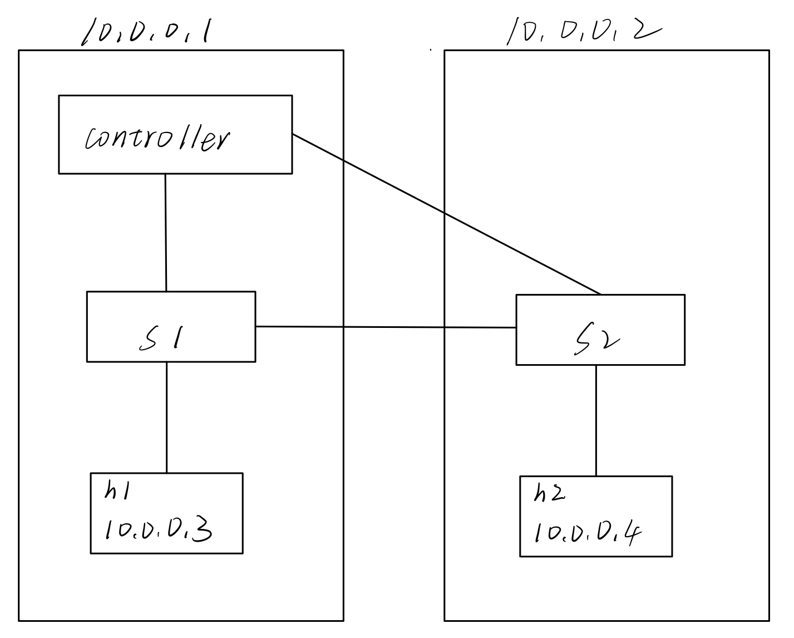

# SDN组网在树莓派上的实现
## 组网目标
实现如图结构的SDN组网：

以adhoc网络为基础，在控制节点的树莓派上运行ryu控制器，OVS交换机，以及一个虚拟主机，虚拟主机是依靠linux的命名空间实现的，并不是真正的虚拟机。在普通节点的树莓派上运行OVS交换机和一个虚拟主机。  
通过ryu控制器控制交换机的转发规则，实现对网络的控制，实验中使用的是simple_switch.py，它实现了一个简单的自学习交换机。网络搭建完毕后，在主机h1上运行简单socket通信的client程序，在主机2上运行sever程序，在宏观上实现控制节点向普通节点的命令传输。
## 组网条件
树莓派两台，adhoc组网成功。[参考博客](https://blog.csdn.net/lby0910/article/details/53420459)   
做控制节点的树莓派安装ryu控制器。  
所有树莓派安装OVS。[参考博客](https://www.cnblogs.com/goldsunshine/p/10331606.html)
## 组网
### 控制节点树莓派:  IP = 10.0.0.1  
开启控制器：
```
ryu-manager simple_switch.py
```
OVS的相关操作需要进入管理员模式：
```
sudo su
```  
开启OVS
```
export PATH=$PATH:/usr/local/share/openvswitch/scripts
ovs-ctl start 
```

创建交换机：
```
ovs-vsctl add-br s1
```
给交换机添加端口：  
第一行会报错，忽略即可。
```
ovs-vsctl add-port s1 p1 
ovs-vsctl set Interface p1 ofport_request=1
ovs-vsctl set Interface p1 type=internal
```
创建主机：
```
ip netns add h1
```
将主机连接到交换机，并设置IP：  
```
ip link set p1 netns h1   
ip netns exec h1 ip addr add 10.0.0.3/24 dev p1  
ip netns exec h1 ifconfig p1 promisc up
```
将无线网卡挂接到交换机的一个端口：
```
ovs-vsctl add-port s1 wlan0
```
wlan0挂接到交换机后，原IP失效。与交换机重名的端口s1有一个虚拟网卡，用来处理本地数据包，将wlan0的IP地址转到s1上，相当于处理本地数据包的任务由wlan0交给了s1：
```
ifconfig wlan0 0
ifconfig s1 10.0.0.1
ifconfig s1 up
```
交换机连接控制器：
```
ovs-vsctl set-controller s1 tcp:10.0.0.1:6653
```
### 普通节点树莓派:  IP = 10.0.0.2

OVS的相关操作需要进入管理员模式：
```
sudo su
```  
开启OVS
```
export PATH=$PATH:/usr/local/share/openvswitch/scripts
ovs-ctl start 
```
创建交换机：
```
ovs-vsctl add-br s2
```
给交换机添加端口：  
第一行会报错，忽略即可。
```
ovs-vsctl add-port s2 p2
ovs-vsctl set Interface p2 ofport_request=1
ovs-vsctl set Interface p2 type=internal
```
创建主机：
```
ip netns add h2
```
将主机连接到交换机，并设置IP：  
```
ip link set p2 netns h2   
ip netns exec h2 ip addr add 10.0.0.4/24 dev p4  
ip netns exec h2 ifconfig p2 promisc up   
```
将无线网卡挂接到交换机的一个端口：
```
ovs-vsctl add-port s2 wlan0
```
将wlan0的IP地址转到s2上：
```
ifconfig wlan0 0
ifconfig s2 10.0.0.2
ifconfig s2 up
```
交换机连接控制器：
```
ovs-vsctl set-controller s2 tcp:10.0.0.1:6653
```

## 测试

h1 ping h2：
```
ip netns exec h1 ping 10.0.0.6
```
h1和h2进行socket通信，分别在控制节点和普通节点运行：
```
ip netns exec h1 python3 SDN_on_Raspberry_pi/client.py
ip netns exec h2 python3 SDN_on_Raspberry_pi/sever.py
```

## 参考文章  
本文参考文章包括但不限于：  
[在树莓派上搭建ad-hoc网络教程](https://blog.csdn.net/lby0910/article/details/53420459)   
[OVS初级教程：使用Open vSwitch构建虚拟网络](https://www.sdnlab.com/sdn-guide/14747.html)  
[Open vSwitch系列之二 安装指定版本ovs](https://www.cnblogs.com/goldsunshine/p/10331606.html)  
[ovs之组网实验](https://www.cnblogs.com/mrwuzs/p/10242737.html)  
[SDN系列学习课程-OpenFlow-Ryu-Mininet](https://www.bilibili.com/video/BV1ft4y1a7ip?spm_id_from=333.1007.top_right_bar_window_default_collection.content.click)  
[TCP/IP网络通信之Socket编程入门](https://www.bilibili.com/video/BV1eg411G7pW?spm_id_from=333.1007.top_right_bar_window_default_collection.content.click)  
感谢一同奋斗的技术人们。